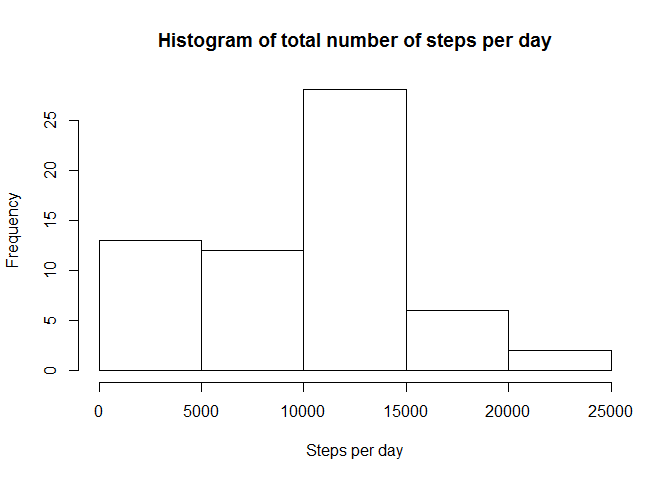
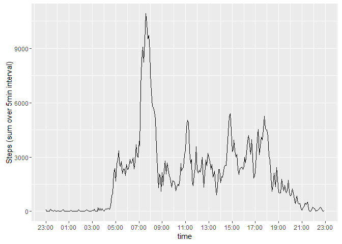
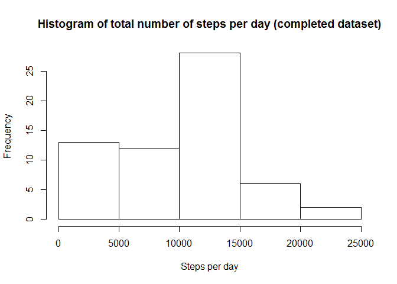
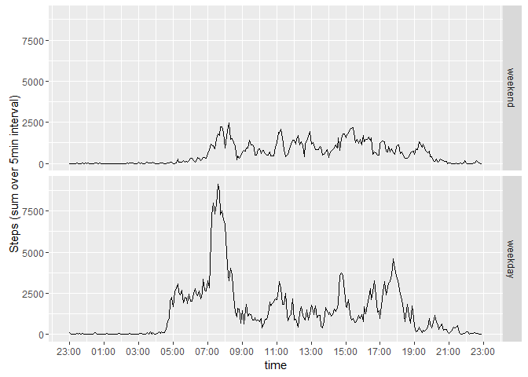

# Reproducible Research: Peer Assessment 1

```r
library(dplyr)
```

```
## Warning: package 'dplyr' was built under R version 3.2.2
```

```
## 
## Attaching package: 'dplyr'
```

```
## The following objects are masked from 'package:stats':
## 
##     filter, lag
```

```
## The following objects are masked from 'package:base':
## 
##     intersect, setdiff, setequal, union
```

```r
library(ggplot2)
```

```
## Warning: package 'ggplot2' was built under R version 3.2.3
```

```r
library(scales)
```

```
## Warning: package 'scales' was built under R version 3.2.3
```


## Loading and preprocessing the data

```r
content <- read.csv("repdata_data_activity/activity.csv")

stepsPerDay <- content %>% 
    group_by(date) %>% 
    summarise(stepSum = sum(steps, na.rm = TRUE))

stepsPerInterval <- content %>% 
    group_by(interval) %>% 
    summarise(stepSum = sum(steps, na.rm = TRUE))
#create reference Date (01.01.1970)
stepsPerInterval$interval <- 
    as.POSIXct(paste("1970/01/01", sprintf("%04d", stepsPerInterval$interval)), format = "%Y/%m/%d %H%M")
```


## What is mean total number of steps taken per day?

```r
hist(stepsPerDay$stepSum, xlab = "Steps per day", main = "Histogram of total number of steps per day")
```



```r
summary(stepsPerDay$stepSum)
```

```
##    Min. 1st Qu.  Median    Mean 3rd Qu.    Max. 
##       0    6778   10400    9354   12810   21190
```


## What is the average daily activity pattern?

```r
ggplot(stepsPerInterval, aes(interval, stepSum)) +
    geom_line() +
    scale_x_datetime(breaks = date_breaks("2 hour"), labels = date_format("%H:%M")) +
    labs(x = "time", y = "Steps (sum over 5min interval)")
```



```r
stepsPerInterval$interval[which(stepsPerInterval$stepSum == max(stepsPerInterval$stepSum))]
```

```
## [1] "1970-01-01 08:35:00 CET"
```


## Imputing missing values

```r
sum(is.na(content$steps))
```

```
## [1] 2304
```
replace 'NA' with average for that day

```r
contentComplete <- content
idxNA <- which(is.na(contentComplete$steps))
contentComplete$steps[idxNA] <- stepsPerDay$stepSum[
    sapply(contentComplete$date[idxNA], function(i) which(stepsPerDay$date == i))]
```
repeat analysis from the start with filled data

```r
stepsPerDayComplete <- contentComplete %>% 
    group_by(date) %>% 
    summarise(stepSum = sum(steps, na.rm = TRUE))
hist(stepsPerDayComplete$stepSum, xlab = "Steps per day", main = "Histogram of total number of steps per day (completed dataset)")
```



```r
summary(stepsPerDayComplete$stepSum)
```

```
##    Min. 1st Qu.  Median    Mean 3rd Qu.    Max. 
##       0    6778   10400    9354   12810   21190
```
Mean/Median should stay equal or increase with the chosen strategy (replace with daily average). Reason is that the total number of steps should increase if there was at least one value for that day. Days with only NA will still have 0 total steps.


## Are there differences in activity patterns between weekdays and weekends?

```r
contentComplete$daytype <- factor(ifelse(as.POSIXlt(content$date)$wd %in% c(0,6), 0, 1), labels = c("weekend", "weekday"))

stepsPerIntervalComplete <- contentComplete %>% 
    group_by(interval, daytype) %>% 
    summarise(stepSum = sum(steps, na.rm = TRUE))
#create reference Date (01.01.1970)
stepsPerIntervalComplete$interval <- 
    as.POSIXct(paste("1970/01/01", sprintf("%04d", stepsPerIntervalComplete$interval)), format = "%Y/%m/%d %H%M")

ggplot(stepsPerIntervalComplete, aes(interval, stepSum)) +
    geom_line() +
    facet_grid(daytype~.) +
    scale_x_datetime(breaks = date_breaks("2 hour"), labels = date_format("%H:%M")) +
    labs(x = "time", y = "Steps (sum over 5min interval)")
```



